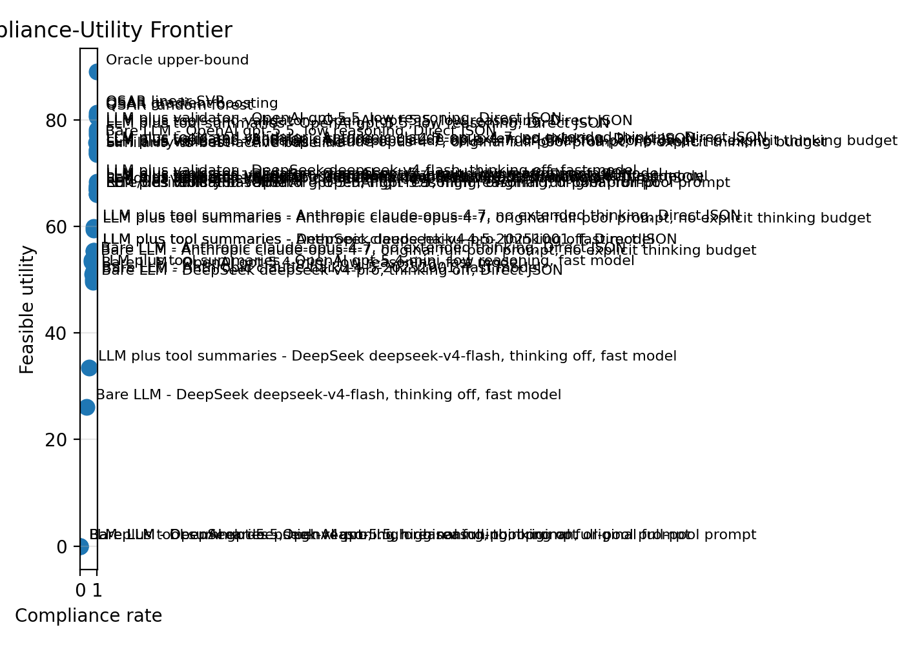

# SpecGuard-Chem v2

SpecGuard-Chem v2 is a reproducible evaluation harness for a narrow but
important question:

> When an AI system follows all the rules, did it also make a better scientific
> decision?

The project studies constrained medicinal-chemistry compound prioritisation.
Given compounds that have already been tested, a fixed candidate pool, hard
constraints, and a small testing budget, each system must return the candidate
IDs it would test next. The benchmark then separates two outcomes that are often
blurred together:

- **Compliance:** did the system return a valid list that obeyed the schema,
  candidate pool, duplicate, support-set, and chemistry-constraint rules?
- **Utility:** among valid selections, did it choose candidates with high hidden
  retrospective activity?

This is not a molecule generator, drug-discovery agent, synthesis planner, or
clinical recommendation system. It is an offline audit tool for ranking supplied
candidate IDs.

## Why It Matters

Guardrails can make model outputs look safer and cleaner without improving the
underlying decision. In scientific workflows, that distinction matters. A system
that is perfectly formatted but chooses weak candidates is not useful; a system
that chooses strong candidates while breaking hard constraints is not deployable.

SpecGuard-Chem v2 makes that tradeoff measurable. It compares deterministic
baselines, QSAR models, bare LLMs, tool-augmented LLMs, and validator-repaired
LLM systems on the same frozen decision cards.

## Result At A Glance

The current paper-facing result is a 50-card CARA lead-optimisation audit. CARA
is a public ChEMBL-derived compound-activity benchmark. Each decision card
contains:

- support compounds with measured activity visible to systems;
- a candidate pool whose activity values are hidden until scoring;
- hard medicinal-chemistry constraints;
- a testing budget of `k=10`.

Headline result: guarded LLM systems were useful and beat simple rule/random
regions, but per-card QSAR baselines remained stronger deployable systems on
this benchmark slice.

| System | Feasible utility | NDCG@k | Compliance |
| --- | ---: | ---: | ---: |
| Oracle upper-bound | 89.022 | 1.000 | 1.000 |
| QSAR linear SVR | 81.382 | 0.910 | 1.000 |
| QSAR gradient boosting | 80.888 | 0.900 | 1.000 |
| QSAR random forest | 80.634 | 0.901 | 1.000 |
| LLM plus validator, OpenAI gpt-5.5, low reasoning, Direct JSON | 78.188 | 0.881 | 1.000 |
| LLM plus tools and validator, OpenAI gpt-5.5, low reasoning, Direct JSON | 77.688 | 0.873 | 1.000 |
| Similarity-to-best-active baseline | 73.603 | 0.825 | 1.000 |

Paired bootstrap over the same 50 cards estimated that `qsar_svm` exceeded the
best final LLM row by `3.194` feasible-utility points, with a 95% interval of
`1.942` to `4.692`. The oracle exceeded `qsar_svm` by `7.639` points, leaving
measurable headroom.



## What I Built

- A data pipeline that converts CARA assay splits into frozen top-k decision
  cards with scorer-only hidden activity values.
- Chemistry-aware validation for schema, candidate IDs, duplicates, support-set
  leakage, RDKit descriptors, and hard constraints.
- Deterministic baselines: random valid, rule/desirability,
  similarity-to-best-active, random forest QSAR, gradient boosting QSAR, and
  linear SVR QSAR.
- LLM system adapters with replay caches, live-call gates, provider/model
  matrices, and raw-vs-repaired output accounting.
- Reporting that separates compliance from utility: leaderboards, bootstrap
  deltas, card-level diagnostics, failure taxonomy, figures, and a static
  results dashboard.

## How To Read The Metrics

- **Feasible utility:** total hidden activity recovered by valid selected
  candidates. Higher is better.
- **NDCG@k:** ranking quality relative to the best feasible top-k choices.
  Higher is better.
- **Compliance:** fraction of required selections that satisfy the output and
  constraint contract. Higher is better.
- **Oracle upper-bound:** the best possible valid top-k selection using hidden
  activity. It is a control, not a deployable system.
- **QSAR:** a conventional quantitative structure-activity model trained
  separately on each card's visible support compounds.

Validator-repaired LLM rows are guarded systems. They should not be read as raw
LLM performance. The reports keep raw model behavior and final repaired behavior
separate so deterministic repair is not mistaken for model skill.

## Key Artifacts

- [Result snapshot](paper/CARA_LO_PAPER_50_RESULTS.md)
- [Generated results summary](paper/RESULTS_SUMMARY.md)
- [Static results dashboard](paper/RESULTS_DASHBOARD.html)
- [Primary leaderboard CSV](paper/tables/cara_lo_paper_50_direct_json_completed/primary_leaderboard.csv)
- [Paired bootstrap deltas](paper/tables/cara_lo_paper_50_direct_json_completed/paired_bootstrap_key_deltas.csv)
- [50-card benchmark artifact](data/cards/cara_lo_paper_50.jsonl)
- [Benchmark card](BENCHMARK_CARD.md)
- [Data card](DATA_CARD.md)
- [Architecture notes](ARCHITECTURE.md)

## Repository Guide

```text
src/specguard_chem_v2/   Python package and CLI implementation
configs/                 model matrix, pricing, and default constraints
data/cards/              committed small/frozen benchmark card artifacts
tests/                   unit tests and fixture cards
paper/                   tracked result tables, figures, dashboard, summaries
docs/                    methods notes, cost controls, run ledger, runbook
plans/                   executed milestone plans and logs
```

Core layers are intentionally plain: schemas, IO, chemistry descriptors and
constraints, CARA ingestion, systems, runner, scoring, reporting, and CLI
orchestration.

## Reproduce Locally

Install with `uv`:

```bash
uv venv --seed
uv pip install -e ".[dev,providers]"
```

Run tests:

```bash
uv run pytest
```

Run an offline fixture suite:

```bash
uv run sgchem validate-cards tests/fixtures/cards.jsonl
uv run sgchem run-suite tests/fixtures/cards.jsonl \
  --systems random_valid,rules_only,similarity_to_best_active,qsar_rf \
  --out runs/fixture
```

Regenerate comparison tables and figures from scored runs:

```bash
uv run sgchem compare-runs runs/fixture/*/scores/summary.json \
  --out runs/fixture/compare
uv run sgchem make-figures runs/fixture/compare/system_comparison.csv \
  --out paper/figures
```

## LLM And Cost Controls

LLM calls are cacheable and disabled by default. Live provider calls require
`--allow-external`. Larger runs should use the cost-estimation and hard-gate
workflow in [docs/COST_CONTROL.md](docs/COST_CONTROL.md).

Export requests for review without calling providers:

```bash
uv run sgchem export-llm-requests data/cards/cara_lo_paper_50.jsonl \
  --systems bare_llm,llm_tools \
  --model-matrix configs/model_matrix.toml \
  --out runs/llm_requests.jsonl
```

## Safety Boundary

SpecGuard-Chem v2 ranks provided candidate IDs for retrospective offline audit.
It does not make prospective efficacy, toxicity, synthesis, selectivity, safety,
or clinical claims. See [BENCHMARK_CARD.md](BENCHMARK_CARD.md) and
[docs/SAFETY.md](docs/SAFETY.md) for the project boundary.

## License

MIT. See [LICENSE](LICENSE).
