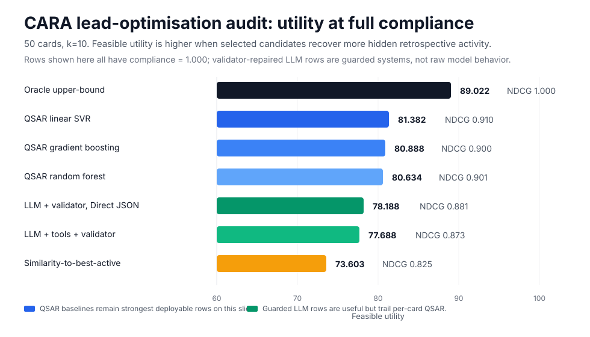

# Constrained Compound Prioritisation

**A reproducible benchmark that separates whether a system *followed the rules* from whether it *made a better scientific decision*.**


This project studies constrained medicinal-chemistry compound prioritisation.
Given compounds that have already been tested, a fixed candidate pool, hard
chemistry constraints, and a small testing budget, each system must return the
candidate IDs it would test next. The benchmark then measures two outcomes that
guardrails routinely blur together:

- **Compliance** — did the system return a valid list that obeys the schema, the
  candidate pool, the no-duplicates rule, the support-set (no-leakage) rule, and
  the hard chemistry constraints?
- **Utility** — among valid selections, did it actually choose candidates with
  high *hidden* retrospective activity?

> A system that is perfectly formatted but picks weak candidates is not useful.
> A system that picks strong candidates while breaking hard constraints is not
> deployable. This benchmark refuses to average those two failures into one score.

It is an offline audit tool for ranking supplied candidate IDs — **not** a
molecule generator, a drug-discovery agent, a synthesis planner, or a clinical
recommender. See [Scope and safety boundary](#scope-and-safety-boundary).

## Findings at a glance

On a frozen 50-card CARA lead-optimisation slice (`k = 10`), evaluated with a
paired card-level bootstrap:

1. **Guardrails buy validity, not decision quality.** A validator loop raises
   every system to perfect compliance, but the ordering by *utility* still tracks
   the underlying model. For a weak model, the validator lifts compliance from
   0.71 to 1.0 while the repaired decisions remain mediocre; for a strong model
   it adds ~1.4 utility points on top of already-high compliance. Repair fixes
   the form of the answer, not the judgement behind it.
2. **A guarded frontier LLM is genuinely useful, and beats naive baselines.** The
   best guarded LLM (OpenAI gpt-5.5, low reasoning, validator, direct-JSON)
   reaches 78.2 feasible utility — **+4.6 over** a similarity-to-best-active
   baseline (95% CI [1.9, 7.3]) and **+12.1 over** a rules/desirability baseline.
3. **But a per-card QSAR model still wins on this slice.** A linear-SVR QSAR
   trained per card scores 81.4 feasible utility, **+3.2 over** the best guarded
   LLM (95% CI [1.9, 4.7], P(Δ>0) = 1.0). The oracle upper bound is 89.0, so
   **7.6 points of headroom remain** above the best deployable system (95% CI
   [6.6, 8.8]).

The takeaway is deliberately unglamorous and, I think, the honest one: on a
constrained selection task with a strong conventional baseline available,
guardrail-heavy LLM systems clear the low bar of "valid and better than random"
but do not yet clear the high bar of "better than a well-specified domain model."

## Headline result

The paper-facing result is a 50-card CARA lead-optimisation audit. CARA is a
public, ChEMBL-derived compound-activity benchmark. Each decision card contains
support compounds with measured activity visible to systems, a candidate pool
whose activity is hidden until scoring, hard medicinal-chemistry constraints, and
a testing budget of `k = 10`.

| System | Feasible utility | NDCG@k | Compliance |
| --- | ---: | ---: | ---: |
| Oracle upper bound *(control, not deployable)* | 89.0 | 1.000 | 1.000 |
| QSAR — linear SVR | **81.4** | 0.910 | 1.000 |
| QSAR — gradient boosting | 80.9 | 0.900 | 1.000 |
| QSAR — random forest | 80.6 | 0.901 | 1.000 |
| LLM + validator — gpt-5.5, low reasoning, direct-JSON | 78.2 | 0.881 | 1.000 |
| LLM + tools + validator — gpt-5.5, low reasoning, direct-JSON | 77.7 | 0.873 | 1.000 |
| Similarity-to-best-active baseline | 73.6 | 0.825 | 1.000 |
| Random-valid baseline | 66.8 | 0.739 | 1.000 |
| Rules / desirability baseline | 66.0 | 0.731 | 1.000 |



The full generated compliance–utility frontier plot is tracked under
[`paper/figures/`](paper/figures/cara_lo_paper_50_direct_json_completed/compliance_utility_frontier.png);
the README uses the simplified SVG above so the headline result stays legible on
GitHub. All deltas come from a paired bootstrap over the *same* 50 cards, so
system comparisons are within-card rather than across independent samples. Full
tables and confidence intervals live in
[`paper/tables/…/paired_bootstrap_key_deltas.csv`](paper/tables/cara_lo_paper_50_direct_json_completed/paired_bootstrap_key_deltas.csv).

## How it works

### The decision card

A card freezes one benchmark instance so every system sees identical inputs and
scoring is deterministic and self-contained:

```text
support_set      compounds already measured — activity VISIBLE to systems
candidate_pool   compounds to choose from — activity HIDDEN until scoring
hard_constraints candidate-level rules (e.g. MW ≤ 500) applied before utility counts
budget_k         how many candidate IDs the system may return (k = 10 here)
```

Systems return ranked candidate IDs only. Hidden `activity_value` fields live in
the card so offline scoring is reproducible, and adapters, prompt builders, and
exported LLM requests are required to redact them — the leakage rules are spelled
out in [DATA_CARD.md](DATA_CARD.md).

### The pipeline

```text
raw CARA assets → import-cara → normalized records → build-cards
  → frozen decision cards → run-suite → trace.jsonl
  → score-run → summary tables + figures + dashboard
```

### The baseline ladder

A benchmark is only as honest as the systems it compares against. This one runs a
graded ladder so an LLM result can be placed on a meaningful scale rather than
against a straw man:

- **Random-valid** — the floor; how far does merely obeying the rules get you?
- **Rules / desirability** and **similarity-to-best-active** — cheap, sensible
  heuristics a chemist might reach for.
- **QSAR** (random forest, gradient boosting, linear SVR) — a conventional
  quantitative structure-activity model trained *separately on each card's
  visible support compounds*. This is the strong, non-language baseline.
- **Oracle valid top-k** — the best possible valid selection using hidden
  activity. A control that bounds the achievable score, not a deployable system.

### LLM systems and the raw-vs-repaired split

LLM systems come in four variants — bare, tool-augmented, validator-repaired, and
tools-plus-validator — run across a provider/model matrix (OpenAI, Anthropic,
DeepSeek) through a cache/replay adapter. Every LLM row is reported **twice**:
`raw_*` metrics capture the model's own output, and the final metrics capture
behaviour after deterministic validator repair. Keeping them separate is what
lets the benchmark say *"the validator added compliance, not medicinal-chemistry
skill"* instead of quietly crediting repair to the model.

### Statistics

System comparisons use a paired card-level bootstrap that resamples cards and
reports mean deltas with 95% confidence intervals and P(Δ > 0). Because the
resampling is paired, it controls for the large card-to-card variance in
absolute activity scale.

## Reproduce locally

The Python package is `specguard-chem-v2` and installs a `sgchem` CLI. Install
with [`uv`](https://github.com/astral-sh/uv):

```bash
uv venv --seed
uv pip install -e ".[dev,providers]"
```

Run the test suite:

```bash
uv run pytest
```

Run the fully offline fixture suite (no network, no API keys):

```bash
uv run sgchem validate-cards tests/fixtures/cards.jsonl
uv run sgchem run-suite tests/fixtures/cards.jsonl \
  --systems random_valid,rules_only,similarity_to_best_active,qsar_rf \
  --out runs/fixture
```

Regenerate comparison tables and figures from scored runs:

```bash
uv run sgchem compare-runs runs/fixture/*/scores/summary.json \
  --out runs/fixture/compare
uv run sgchem make-figures runs/fixture/compare/system_comparison.csv \
  --out paper/figures
```

`uv run sgchem --help` lists the full command surface (ingestion, card building,
running, scoring, reporting, and cost estimation).

## Interpreting the metrics

- **Feasible utility** — total hidden activity recovered by the valid selected
  candidates. With `k = 10`, a utility of 70 means ten valid selections averaged
  ~7.0 pIC50/pChEMBL. Higher is better.
- **NDCG@k** — ranking quality relative to the best feasible top-k choices.
  Higher is better; 1.0 is ideal.
- **Compliance** — fraction of required selections that satisfy the output and
  constraint contract. Higher is better.
- **Constrained regret** — oracle valid top-k utility minus observed feasible
  utility. Lower is better.
- **Oracle upper bound** — the best possible valid top-k selection given hidden
  activity. A control that bounds the score, not a system you could deploy.

Validator-repaired LLM rows are *guarded systems*; they are not a measure of raw
model skill. Reports keep raw and repaired behaviour separate so deterministic
repair is never mistaken for decision quality.

## LLM and cost controls

Live provider calls are **disabled by default** and require an explicit
`--allow-external` flag; without it, LLM systems run from cache/replay only.
Larger live runs go through the cost-estimation and hard-gate workflow in
[docs/COST_CONTROL.md](docs/COST_CONTROL.md).

Export the exact requests for review without calling any provider:

```bash
uv run sgchem export-llm-requests data/cards/cara_lo_paper_50.jsonl \
  --systems bare_llm,llm_tools \
  --model-matrix configs/model_matrix.toml \
  --out runs/llm_requests.jsonl
```

## Repository guide

```text
src/specguard_chem_v2/   Python package and Typer CLI (sgchem)
  ├─ schemas.py          Pydantic contracts for cards, outputs, run records
  ├─ chem/               RDKit descriptors, fingerprints, constraint checks
  ├─ data/               CARA download, import, and card building
  ├─ systems/            deterministic baselines + LLM cache/replay adapters
  ├─ runner.py           system execution, output validation, validator repair
  ├─ scoring.py          per-card metrics and aggregation
  └─ reports.py          comparison tables, figures, and the results dashboard
configs/                 model matrix, provider pricing, default constraints
data/cards/              committed small/frozen benchmark card artifacts
tests/                   unit tests and fixture cards
paper/                   tracked result tables, figures, dashboard, summaries
docs/                    methods notes, data card, cost controls, run ledger
plans/                   executed milestone plans and run logs
```

Core layers depend downward only: the CLI may orchestrate everything, but the
schema, IO, chemistry, scoring, and reporting layers do not import the CLI. See
[ARCHITECTURE.md](ARCHITECTURE.md).

## Scope and safety boundary

This project ranks provided candidate IDs for retrospective, offline audit. It
makes **no** prospective claims about efficacy, toxicity, synthesis, selectivity,
safety, or clinical use. CARA-derived tasks are assay-grounded but lack wet-lab
prospective validation, ADMET evidence, and project-team decision context.
Retrospective activity is treated as retrospective evidence and nothing more. See
[BENCHMARK_CARD.md](BENCHMARK_CARD.md) and [docs/SAFETY.md](docs/SAFETY.md).

## Key artifacts

- [Result snapshot](paper/CARA_LO_PAPER_50_RESULTS.md) — the paper-facing writeup
- [Static results dashboard](paper/RESULTS_DASHBOARD.html) — interactive leaderboard, diagnostics, and tooltips
- [Primary leaderboard CSV](paper/tables/cara_lo_paper_50_direct_json_completed/primary_leaderboard.csv)
- [Paired bootstrap deltas](paper/tables/cara_lo_paper_50_direct_json_completed/paired_bootstrap_key_deltas.csv)
- [50-card benchmark artifact](data/cards/cara_lo_paper_50.jsonl)
- [Benchmark card](BENCHMARK_CARD.md) · [Data card](DATA_CARD.md) · [Architecture](ARCHITECTURE.md)

## License

MIT — see [LICENSE](LICENSE).
