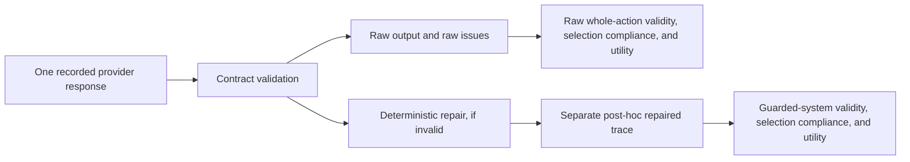

# LLM Failure Modes

> **Historical-evidence warning.** The former paper-50 LLM runs used invalid
> cards produced by the pre-v0.1.0 importer. Their numerical results and
> model-comparison claims are not evidence for this benchmark. The engineering
> risks observed while running them informed the safeguards below, but v0.1.0
> LLM outcomes must come from new traces over the corrected 91-card artifacts.

## What Must Be Kept Separate

Every publishable condition has three conceptually distinct outcomes:

1. **Execution status:** did the provider return a complete response for the
   frozen request?
2. **Raw model behavior:** did that response satisfy the action contract, and
   how useful was its unaided ranking?
3. **Guarded-system behavior:** after deterministic post-hoc repair of the same
   response, can the combined model-plus-harness system produce a valid list?

Transport failure is not a low-utility model decision, and repaired output is
not raw model ability.

## Failure Taxonomy

### Provider and execution failures

- missing credentials, quota or credit exhaustion;
- provider overload, timeout, or connection failure;
- context-limit rejection;
- truncated response or no visible final answer; and
- incomplete trace/cache write.

These are run-feasibility failures. Preserve them explicitly, retry only under a
documented policy, and do not score synthetic empty selections as if the model
chose them.

### Contract failures

- malformed JSON, prose, markdown, or multiple objects;
- wrong `task_id` or `system_name`;
- fewer or more than `k` selections;
- duplicate, unknown, or support-set candidate IDs;
- rank gaps or inconsistent rank order; and
- selection of candidates that violate deterministic hard constraints.

Whole-action validity requires zero validation issues across the complete
output. `compliance_rate` is only the valid-selection fraction and can still be
`1.0` when another contract issue, such as a wrong task ID, invalidates the
action. Neither measure establishes that selected compounds are useful.

### Utility failures

A response can be perfectly valid yet rank weak candidates, fail to transfer
from the support set, collapse to a generic descriptor heuristic, or
underperform similarity/QSAR. Utility, whole-action validity, and partial
selection compliance therefore remain separate views rather than being
collapsed into one success rate.

### Interface and scale failures

The benchmark sends the full candidate pool. The largest conservative v0.1.0
request estimate is 158,274 input tokens. Large prompts can magnify latency,
tokenization differences, quota pressure, and output truncation. Explicit
reasoning/thinking modes may also consume output budget without yielding a
machine-readable final object.

The frozen release mitigates these risks by using a direct-JSON profile, a 4,096
output-token cap, no extended thinking where avoidable, exact request export,
and pre-run cost/context gates. Reasoning-budget variants are separate pilots,
not substitutions for the primary matrix.

## Why Post-hoc Repair Can Mislead

The repair policy keeps valid selections and deterministically fills missing
slots from a label-free fallback ranking. It cannot see hidden candidate
activities and is not an oracle. Even so, it can materially increase
whole-action validity, valid-selection fraction, or utility, particularly when
the raw response is empty or malformed.

For that reason:

- never overwrite the raw trace;
- never make another provider request under the name of repair;
- bind the repaired view to the source-trace SHA256 and named repair policy;
- report `repaired_rate` and `repaired_from_empty_rate`;
- report raw metrics before guarded-system metrics; and
- label guarded results as model plus deterministic harness, not model-only.

The v0.1.0 design calls only `bare_llm` and `llm_tools`, then applies
`repair-llm-trace` to each response after the fact. The old prompt-level
`llm_validator` and `llm_tools_validator` matrix is not part of the release
comparison.

## Required Run Checks

Before live execution:

1. verify the exact 546 request rows and their system-input hashes;
2. confirm candidate activities are absent;
3. re-check model availability, context limits, and pricing;
4. run the fixed six-request task-ID pilot with its shared matrix cache and hard
   spend gates; and
5. confirm provider errors remain distinguishable from valid empty/malformed
   responses.

After execution:

1. require 91 trace rows for each of the six raw conditions;
2. record exact model IDs, generation settings, usage, retries, and failures;
3. validate raw issues against the current contract;
4. derive repaired traces without network access;
5. score with the hash-bound v0.1.0 scorer outcomes; and
6. present paired-card uncertainty and failure counts alongside averages.

See `docs/COST_CONTROL.md` for spend gates and `docs/POSTHOC_REPAIR.md` for the
repair artifact contract.
