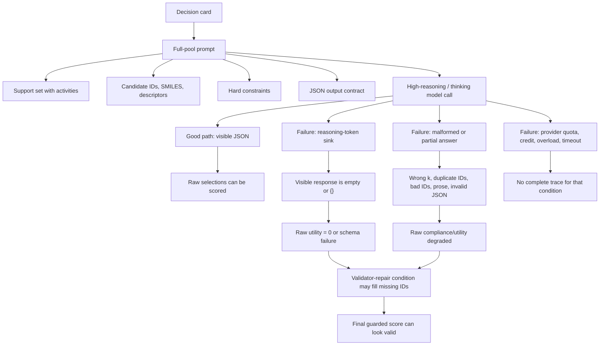
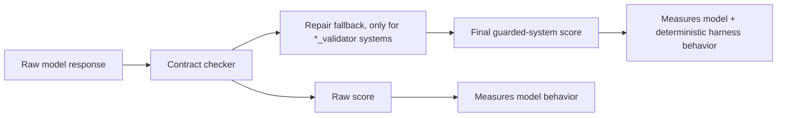
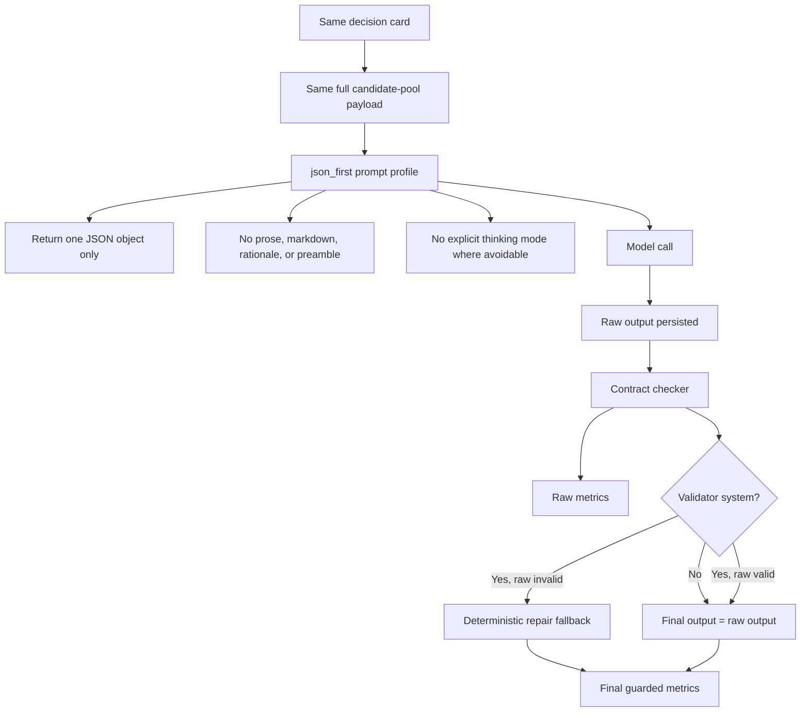

# LLM Failure Modes

This note records the observed LLM-interface failure modes from the paper-50
runs. It is part of the methods record: these are not chemistry conclusions by
themselves, but they explain why raw and repaired outputs must be separated.

## Validator Terminology

In this repository, a `*_validator` system is not just a passive validator. It is
a guarded system with two deterministic stages:

1. Check the raw model output against the task contract: schema, candidate-pool
   membership, duplicates, support-set exclusion, and hard constraints such as
   RDKit-computed property bounds or alert rules.
2. If the raw output is invalid, repair it by keeping valid selections and
   filling missing slots with the deterministic fallback ranking.

The checker is not an oracle. It does not see hidden activity values and cannot
know the best compounds. The repair fallback is harness behavior, not model
behavior. For paper claims, report:

- raw LLM metrics from `raw_output` and `raw_issues`;
- final guarded-system metrics from `output` and `issues`;
- `repaired_rate` and `repaired_from_empty_rate`.

The repair fallback is useful as an operational guardrail condition, but it must
not be described as raw LLM medicinal-chemistry performance.

## Original High-Reasoning Failure Mode

The key observed OpenAI high-reasoning failure was not that the model selected
bad compounds; it often failed to produce visible final JSON at all. The output
budget was consumed by reasoning tokens, leaving no usable candidate list.

## Why Repair Can Mislead

A repaired final score answers an operational question: "Can this guarded system
produce a valid list?" It does not answer the model-quality question by itself:
"Did the model choose useful valid compounds unaided?"

## Current Direct-JSON Mitigation

The direct-JSON interface keeps the same cards, full candidate pool, constraints,
and systems. It changes the model interface so the model is asked to emit the
final JSON object immediately, without explicit high/extended-thinking mode
where avoidable.

This mitigation does not change the benchmark task. It is an interface ablation:
direct final-answer JSON versus high-reasoning/thinking interface.

## Cost And Feasibility Failure

The full-pool prompt is itself large. A single tool-summary decision card can
contain more than 100k prompt tokens depending on provider tokenization. Provider
quota failures therefore need to be treated as run-feasibility failures, not as
model-performance scores.

Before future live runs, use cheap pilots and explicit budget gates. A full run
should not start unless estimated calls, tokens, and cost are acceptable.
