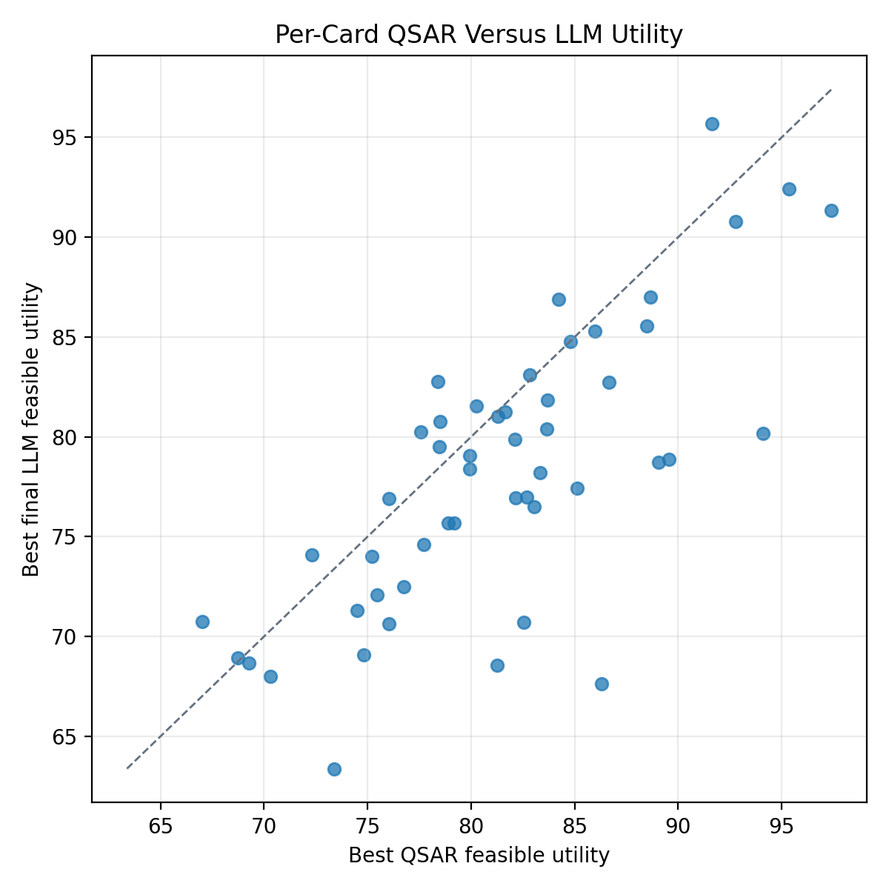
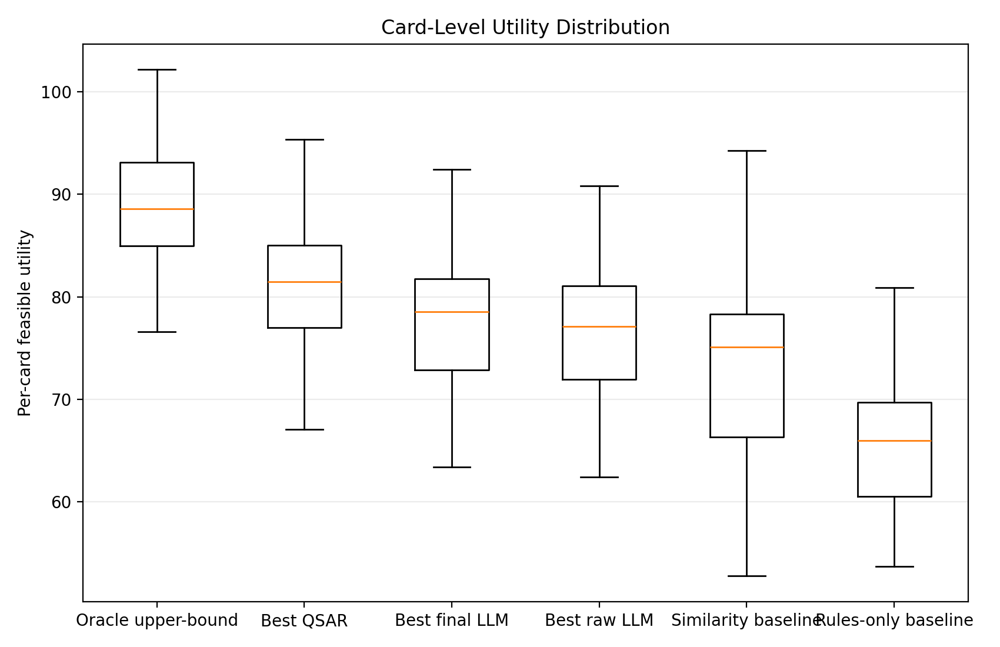
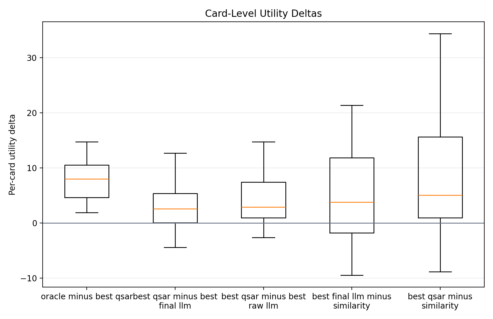

<div class="kicker">SpecGuard-Chem v2</div>

# Compliance Is Not Utility

## Auditing guarded LLM systems for constrained medicinal-chemistry compound prioritisation

<div class="hero-grid">
  <div>
    <p class="lead">
      A system can follow every written rule and still make weak choices.
      This project asks whether guarded and tool-using LLM systems improve
      useful top-k decisions, or mostly improve output validity.
    </p>
  </div>
  <div class="metric-stack">
    <div><b>50</b><span>CARA LO decision cards</span></div>
    <div><b>10</b><span>candidate IDs per card</span></div>
    <div><b>2 axes</b><span>utility and compliance</span></div>
  </div>
</div>

<!--
Speaker notes:
Open with the narrowed claim. This is not a broad drug-design agent benchmark. It is a decision audit for the point in a lead-optimisation project where a team has tested some compounds and must choose what to assay next.
-->

---

# The Question

<div class="two-col">
  <div>
    <h3>What ordinary validity misses</h3>
    <p>A recommendation can be perfectly well-formed, valid under constraints, and still unhelpful for the project.</p>
    <ul>
      <li>Valid but low-activity candidates</li>
      <li>High compliance without high utility</li>
      <li>Validator repair that looks like model improvement</li>
    </ul>
  </div>
  <div>
    <h3>What activity alone misses</h3>
    <p>High hidden activity is not enough if the selected compounds violate the written project specification.</p>
    <ul>
      <li>Wrong number of candidates</li>
      <li>Candidate IDs outside the pool</li>
      <li>Duplicates or support-set leakage</li>
      <li>Descriptor or alert violations</li>
    </ul>
  </div>
</div>

<div class="thesis">
  The paper's core move is to evaluate <b>useful valid decisions</b>, not validity or activity in isolation.
</div>

<!--
Speaker notes:
The phrase to make stick is "compliance is not utility." The project is about separating those two axes and then asking which systems are good on both.
-->

---

# Lead Optimisation As A Decision Problem

<div class="flow">
  <div class="node">Already-tested support compounds<br/><span>activity visible</span></div>
  <div class="arrow">-></div>
  <div class="node">Candidate pool<br/><span>activity hidden</span></div>
  <div class="arrow">-></div>
  <div class="node">Hard constraints<br/><span>schema + chemistry checks</span></div>
  <div class="arrow">-></div>
  <div class="node">Ranked top-k IDs<br/><span>next assay priorities</span></div>
</div>

<div class="panel-grid">
  <div><b>Systems see</b><br/>support activity, candidate IDs, SMILES, descriptors, budget, constraints</div>
  <div><b>Scorer sees</b><br/>hidden candidate activity for retrospective utility metrics</div>
  <div><b>Systems return</b><br/>ranked candidate IDs only, never novel molecules</div>
</div>

<!--
Speaker notes:
CARA starts as an activity-prediction substrate. SpecGuard-Chem converts it into a decision-card substrate: choose the next k compounds from a fixed pool.
-->

---

# Paper-50 Dataset Snapshot

<div class="stat-row">
  <div><b>50</b><span>frozen CARA LO cards</span></div>
  <div><b>10</b><span>budget k per card</span></div>
  <div><b>48.8</b><span>mean support compounds</span></div>
  <div><b>292.2</b><span>mean candidate pool</span></div>
  <div><b>162.4</b><span>mean feasible candidates</span></div>
</div>

<div class="caption-box">
  Card artifact: <code>data/cards/cara_lo_paper_50.jsonl</code><br/>
  Selection policy: <code>largest_candidate_pool</code><br/>
  SHA256: <code>9c4e45880dd6fe97643c1bcfd66a16a0f72b4a0e0a60476f12bc58d464d80d03</code>
</div>

<!--
Speaker notes:
The key reassurance is that cards are frozen before interpretation. Activity values for candidate compounds remain hidden from non-oracle systems.
-->

---

# Systems Compared

<div class="system-grid">
  <div>
    <h3>Controls</h3>
    <p><b>Oracle upper-bound</b><br/>Uses hidden candidate activity. Sanity check only.</p>
    <p><b>Random valid</b><br/>Selects feasible candidates at random.</p>
  </div>
  <div>
    <h3>Non-language baselines</h3>
    <p><b>Rules-only</b><br/>Descriptor desirability after constraints.</p>
    <p><b>Similarity</b><br/>Nearest to the best active support compound.</p>
    <p><b>QSAR</b><br/>RF, gradient boosting, linear SVR trained per card on support fingerprints.</p>
  </div>
  <div>
    <h3>LLM conditions</h3>
    <p><b>Bare LLM</b>, <b>validator</b>, <b>tools</b>, <b>tools + validator</b></p>
    <p>Run across OpenAI, Anthropic, and DeepSeek fast/frontier/direct-JSON conditions.</p>
  </div>
</div>

<!--
Speaker notes:
Do not compare LLMs only with LLMs. The key methodological point is that QSAR is a deployable chemistry baseline, while the oracle is not.
-->

---

# Metrics: Two Axes, One Decision

<div class="metric-grid">
  <div>
    <h3>Utility</h3>
    <p><b>Feasible utility</b>: hidden activity credited only for valid selected candidates.</p>
    <p><b>NDCG@k</b>: whether the best candidates are ranked near the top.</p>
    <p><b>Constrained regret</b>: oracle valid top-k utility minus system utility.</p>
  </div>
  <div>
    <h3>Compliance</h3>
    <p><b>Compliance rate</b>: valid selected entries divided by k.</p>
    <p><b>Schema error rate</b>: malformed or contract-breaking outputs.</p>
    <p><b>Violation counts</b>: pool, duplicate, support, and molecular constraints.</p>
  </div>
  <div>
    <h3>LLM accounting</h3>
    <p><b>Raw metrics</b>: score what the model returned before repair.</p>
    <p><b>Final metrics</b>: score guarded output after deterministic repair.</p>
    <p><b>Repair rate</b>: how much the guardrail changed the output.</p>
  </div>
</div>

<!--
Speaker notes:
The raw-versus-final split is a major contribution. Validator repair can be operationally useful, but it must not be mistaken for raw model judgement.
-->

---

# Headline Result

<div class="bars">
  <div class="bar-row"><span>Oracle upper-bound</span><div><i style="width:100%"></i></div><b>89.0</b></div>
  <div class="bar-row"><span>QSAR linear SVR</span><div><i style="width:91.4%"></i></div><b>81.4</b></div>
  <div class="bar-row"><span>QSAR gradient boosting</span><div><i style="width:90.9%"></i></div><b>80.9</b></div>
  <div class="bar-row"><span>QSAR random forest</span><div><i style="width:90.6%"></i></div><b>80.6</b></div>
  <div class="bar-row accent"><span>Best final LLM</span><div><i style="width:87.8%"></i></div><b>78.2</b></div>
  <div class="bar-row"><span>Similarity baseline</span><div><i style="width:82.7%"></i></div><b>73.6</b></div>
  <div class="bar-row"><span>Rules-only baseline</span><div><i style="width:74.2%"></i></div><b>66.0</b></div>
</div>

<div class="result-line">
  Best deployable family: <b>QSAR</b>. Best LLM rows are useful, but remain below all three QSAR baselines in this LO run.
</div>

<!--
Speaker notes:
The best final LLM is OpenAI gpt-5.5 low reasoning Direct JSON plus validator at 78.188 feasible utility. QSAR SVM is 81.382. The oracle at 89.022 shows remaining headroom.
-->

---

# Compliance-Utility Frontier

<div class="frontier-clean">
  <div class="frontier-axis y">Compliance</div>
  <div class="frontier-axis x">Feasible utility</div>
  <div class="frontier-gridline h1"></div>
  <div class="frontier-gridline h2"></div>
  <div class="frontier-gridline v1"></div>
  <div class="frontier-gridline v2"></div>
  <div class="point rules" style="left: 12%; bottom: 88%"><b>Rules</b><span>66.0 / 1.00</span></div>
  <div class="point similarity" style="left: 36%; bottom: 88%"><b>Similarity</b><span>73.6 / 1.00</span></div>
  <div class="point llm" style="left: 58%; bottom: 88%"><b>Best LLM</b><span>78.2 / 1.00</span></div>
  <div class="point qsar" style="left: 72%; bottom: 88%"><b>QSAR SVR</b><span>81.4 / 1.00</span></div>
  <div class="point oracle" style="left: 89%; bottom: 88%"><b>Oracle</b><span>89.0 / 1.00</span></div>
  <div class="point bare" style="left: 50%; bottom: 74%"><b>Bare OpenAI LLM</b><span>75.8 / 0.96</span></div>
  <div class="frontier-caption">Higher utility -></div>
</div>

<div class="figure-note">
  Near-perfect compliance appears across systems with materially different utility. The audit is about moving right without falling down.
</div>

<!--
Speaker notes:
The plot makes the argument visual: moving up on compliance is not the same as moving right on useful prioritisation.
-->

---

# Paired Evidence, Same 50 Cards

<div class="delta-grid">
  <div>
    <b>+3.19</b>
    <span>QSAR linear SVR over best final LLM</span>
    <em>95% paired bootstrap: 1.94 to 4.69</em>
  </div>
  <div>
    <b>+4.59</b>
    <span>Best final LLM over similarity baseline</span>
    <em>95% paired bootstrap: 1.94 to 7.27</em>
  </div>
  <div>
    <b>+7.64</b>
    <span>Oracle upper-bound over QSAR linear SVR</span>
    <em>95% paired bootstrap: 6.57 to 8.80</em>
  </div>
</div>

<p class="body-copy">
  The aggregate QSAR-over-LLM result persists when resampling paired decision cards,
  not just when comparing leaderboard means.
</p>

<!--
Speaker notes:
This is the statistical confidence slide. It also keeps the interpretation balanced: LLM beats similarity, but QSAR still beats the best final LLM.
-->

---

# Raw Model Behavior vs Guarded System Behavior

<table class="compact-table">
  <thead>
    <tr><th>Condition</th><th>Raw utility</th><th>Final utility</th><th>Repair rate</th></tr>
  </thead>
  <tbody>
    <tr><td>OpenAI gpt-5.5 Direct JSON + validator</td><td>76.76</td><td>78.19</td><td>14%</td></tr>
    <tr><td>OpenAI gpt-5.5 Direct JSON + tools + validator</td><td>77.21</td><td>77.69</td><td>4%</td></tr>
    <tr><td>Anthropic Opus Direct JSON + tools + validator</td><td>62.86</td><td>74.47</td><td>58%</td></tr>
    <tr><td>DeepSeek Pro Direct JSON + validator</td><td>49.20</td><td>67.62</td><td>56%</td></tr>
  </tbody>
</table>

<div class="callout">
  Validator-assisted rows answer an operational question: can the guarded system produce a valid list? Raw rows answer a model-quality question.
</div>

<!--
Speaker notes:
This is where to be careful. The validator does not see hidden activity. But when it fills invalid or missing selections, final scores are model plus harness, not pure model behaviour.
-->

---

# High-Reasoning Failure Was An Interface Failure

<div class="flow vertical">
  <div class="node">Full-pool prompt<br/><span>large candidate JSON, support set, constraints</span></div>
  <div class="arrow">-></div>
  <div class="node">High-reasoning / thinking call<br/><span>large hidden reasoning budget</span></div>
  <div class="arrow">-></div>
  <div class="node danger">No visible final JSON<br/><span>schema failure or empty output</span></div>
  <div class="arrow">-></div>
  <div class="node">Validator fallback may repair<br/><span>valid final output, but not raw model selection</span></div>
</div>

<div class="body-copy">
  Direct JSON kept the task fixed but changed the interface: final JSON first, no prose, no avoidable thinking mode.
</div>

<!--
Speaker notes:
Avoid saying the high-reasoning model "failed chemistry." The observed failure was that the interface consumed the visible output budget and produced no usable JSON on some conditions.
-->

---

# Card-Level Diagnostics

<div class="figure-grid plot-slide">
  <div class="figure-card">



  </div>
  <div class="plot-explain">
    <h3>How to read it</h3>
    <p>Each dot is one decision card.</p>
    <p><b>Above the diagonal:</b> the LLM row had higher feasible utility than QSAR on that card.</p>
    <p><b>Below the diagonal:</b> QSAR had higher feasible utility.</p>
    <p>The paired view matters because every system is being scored on the same frozen cards.</p>
  </div>
</div>

<!--
Speaker notes:
Use this slide if asked whether the headline is only an average. It shows card-level pairings, not independent aggregate means.
-->

---

# Card-Level Utility Distribution

<div class="figure-card figure-solo">



</div>

<div class="figure-note">
  This plot shows the spread of feasible utility across the 50 cards for the key systems. Wider spread means performance varies more by assay card.
</div>

<!--
Speaker notes:
This is a distribution across cards, not uncertainty around a single mean. It helps show how stable or variable each system is card by card.
-->

---

# Card-Level Utility Deltas

<div class="figure-card figure-solo">



</div>

<div class="figure-note">
  These are card-level utility differences. The whiskers show the observed card range, not a 95% or 99% confidence interval; the paired bootstrap CIs are reported separately on the paired-evidence slide.
</div>

<!--
Speaker notes:
Make clear that this is showing distribution/range across actual cards. Statistical uncertainty is handled by the paired bootstrap slide, not by these whiskers.
-->

---

# Result Readout

<div class="hypothesis-list">
  <div><b>1</b><span>Validators reliably improve validity.</span><em>But final guarded scores must be separated from raw model behavior.</em></div>
  <div><b>2</b><span>QSAR is a serious baseline.</span><em>It is the strongest deployable family in this LO result set.</em></div>
  <div><b>3</b><span>Tool summaries can help some LLM rows.</span><em>This does not yet test a full agent with callable QSAR, RDKit, or retrieval tools.</em></div>
  <div><b>4</b><span>Compliance and utility are not interchangeable.</span><em>Several near-perfectly compliant systems have materially different utility.</em></div>
</div>

<!--
Speaker notes:
The most defensible paper claim is methodological and empirical, not sweeping. It is a protocol plus a result on this LO paper-50 run.
-->

---

# What This Paper Contributes

<div class="contribution-grid">
  <div><b>1</b><span>A decision-card protocol for constrained top-k prioritisation</span></div>
  <div><b>2</b><span>Separate utility, compliance, regret, and repair accounting</span></div>
  <div><b>3</b><span>Strong deployable non-language baselines, especially per-card QSAR</span></div>
  <div><b>4</b><span>Evidence that interface design can dominate raw LLM behavior</span></div>
  <div><b>5</b><span>Reproducible paper artifacts: tables, figures, dashboard, logs, and traces</span></div>
</div>

<div class="result-line">
  Main claim: SpecGuard-Chem separates medicinal-chemistry decision utility from specification compliance and tests guarded LLM systems against strong baselines.
</div>

<!--
Speaker notes:
This is the slide to use if someone asks "so what is the contribution?" Keep it framed as an empirical audit protocol.
-->

---

# Scope Boundaries

<div class="do-not-grid">
  <div><b>We are claiming</b><br/>A reproducible audit protocol for constrained, finite-budget candidate prioritisation.</div>
  <div><b>We are not claiming</b><br/>That any selected compound is a real drug candidate.</div>
  <div><b>We are claiming</b><br/>In this LO paper-50 run, QSAR baselines outperform the best current LLM rows.</div>
  <div><b>We are not claiming</b><br/>That LLMs are intrinsically poor at medicinal chemistry.</div>
  <div><b>We are claiming</b><br/>Compliance alone is not enough evidence of useful prioritisation.</div>
  <div><b>We are not claiming</b><br/>Synthesis feasibility, ADMET, selectivity, safety, clinical relevance, or de novo design.</div>
</div>

<!--
Speaker notes:
This should sound like scope discipline, not a warning label. The study is retrospective computational prioritisation.
-->

---

# Backup: Reproducibility Commands

```bash
uv run pytest
uv run sgchem validate-cards data/cards/cara_lo_paper_50.jsonl
uv run sgchem compare-runs \
  runs/cara_lo_paper_50_baselines/*/scores/summary.json \
  runs/cara_lo_paper_50_llm_matrix/*/*/scores/summary.json \
  runs/cara_lo_paper_50_selector_matrix/*/*/scores/summary.json \
  --out paper/tables/cara_lo_paper_50_direct_json_completed
uv run sgchem make-figures \
  paper/tables/cara_lo_paper_50_direct_json_completed/system_comparison.csv \
  --out paper/figures/cara_lo_paper_50_direct_json_completed
```

<div class="caption-box">
  Default validation uses cached/replayed LLM artifacts. Live LLM calls require <code>--allow-external</code>, cost estimates, and hard gates.
</div>

<!--
Speaker notes:
This is a backup slide for methodology questions. It shows the run is traceable and that live-provider cost/spend is controlled.
-->
