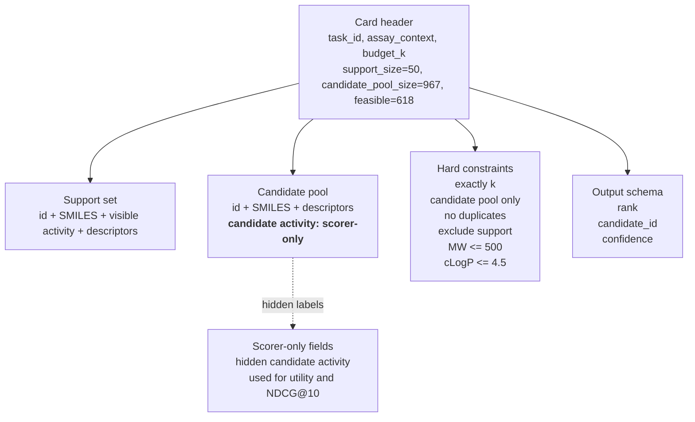
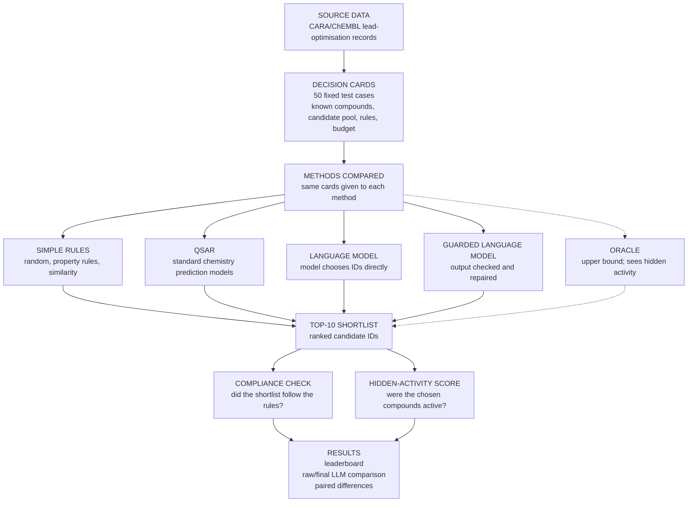

# Figure Storyboards

This file is for workshopping figure structure before final rendering. Diagrams
should stay easy to edit in plain text. Use these as the system of record for
layout and wording until a figure is ready for production artwork.

## Figure 1: Frozen Decision Card Anatomy

Goal: explain what a decision card contains without tying the figure to one LLM
prompt implementation.

### ASCII Draft

```text
Example frozen decision card
CARA_LO_CHEMBL2328568_IC50_0001

+--------------------------------------------------------------------------+
| CARD HEADER                                                              |
| task_id: CARA_LO_CHEMBL2328568_IC50_0001                                 |
| assay_context: source=CARA; assay_id=CHEMBL2328568_IC50                  |
| budget_k: 10; support_size: 50; candidate_pool_size: 967; feasible: 618  |
+--------------------------------------------------------------------------+

+--------------------------------------------------------------------------+
| SUPPORT SET                                                              |
| Visible to deployable systems: id, SMILES, support activity, descriptors |
|                                                                          |
| id          smiles                         activity    descriptors        |
| CHEMBL...   CC(C)(C)c1[nH]...              6.44        MW, cLogP, TPSA... |
| CHEMBL...   Cc1c(F)ccc2[nH]...             8.15        MW, cLogP, TPSA... |
+--------------------------------------------------------------------------+

+--------------------------------------------------------------------------+
| CANDIDATE POOL                                                           |
| Visible: id, SMILES, descriptors                                         |
| Hidden from deployable systems: candidate activity                        |
|                                                                          |
| id          smiles                         activity     descriptors       |
| CHEMBL...   COc1cc(CN...)...               scorer-only  MW, cLogP, TPSA...|
| CHEMBL...   COc1cc(CNc...)...              scorer-only  MW, cLogP, TPSA...|
+--------------------------------------------------------------------------+

+-------------------------------------+    +------------------------------+
| HARD CONSTRAINTS                    |    | OUTPUT SCHEMA                |
| exactly k                           |    | rank: integer                |
| candidate pool only                 |    | candidate_id: string         |
| no duplicates                       |    | confidence: optional number  |
| exclude support                     |    +------------------------------+
| MW <= 500                           |
| cLogP <= 4.5                        |
| forbidden SMARTS: []                |
+-------------------------------------+

+--------------------------------------------------------------------------+
| LEAKAGE BOUNDARY                                                         |
| Support activity is input. Candidate activity is stored for scoring only. |
| Only the oracle upper-bound control uses hidden candidate activity.        |
+--------------------------------------------------------------------------+
```

### Mermaid Draft



## Figure 2: Benchmark Pipeline

Goal: explain the full evaluation flow, keeping it distinct from Figure 1.
Use accessible wording without making the boxes wordy.

### ASCII Draft

Use this as a wording sketch. The Mermaid draft below is the clearer layout
reference because each method card feeds the top-10 shortlist.

```text
SOURCE DATA
CARA/ChEMBL lead-optimisation records
        |
        v
DECISION CARDS
50 fixed test cases
contents: known compounds, candidate pool, rules, budget
        |
        v
METHODS COMPARED
        |
        +--> SIMPLE RULES
        |    random, property rules, similarity
        |
        +--> QSAR
        |    standard chemistry prediction models
        |
        +--> LLM
        |    language model alone
        |
        +--> GUARDED LLM
        |    language model plus validation/repair
        |
        +--> ORACLE
             upper bound; sees hidden activity
                 |
                 v
TOP-10 SHORTLIST
ranked candidate IDs
        |
        v
        +--> COMPLIANCE CHECK
        |    did the shortlist follow the rules?
        |
        +--> HIDDEN-ACTIVITY SCORE
             were the chosen compounds active?
                 |
                 v
RESULTS
leaderboard, raw/final LLM comparison, paired differences

Notes:
candidate activity is hidden from tested methods
oracle is reported separately as an upper bound
```

Even more compact version:

```text
Source data
        |
        v
50 decision cards
        |
        v
Methods choose 10 candidates
        |
        v
Shortlists checked and scored
        |
        v
Results
```

### Mermaid Draft


