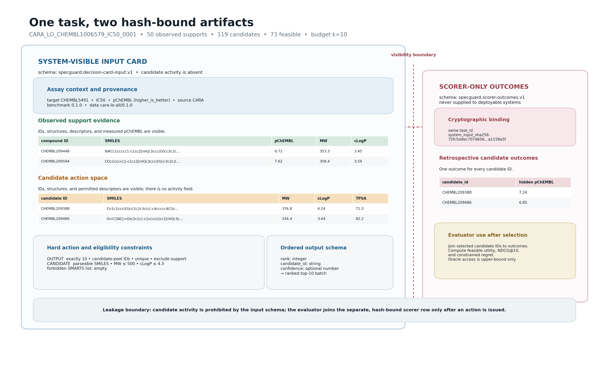
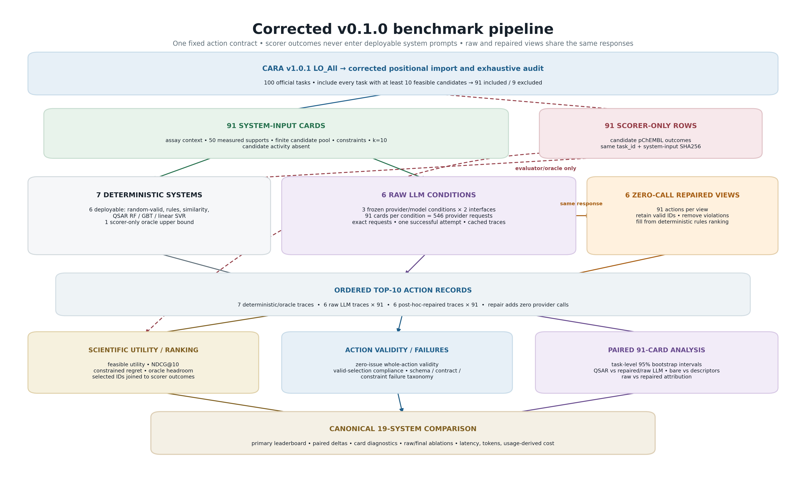
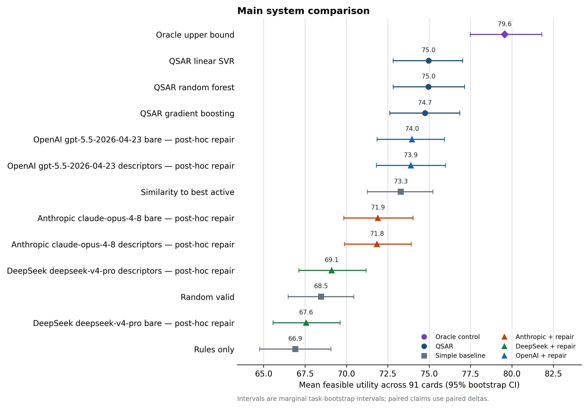
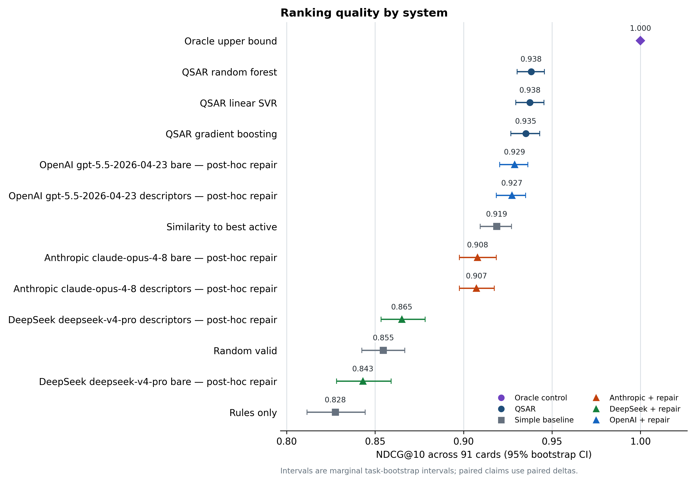
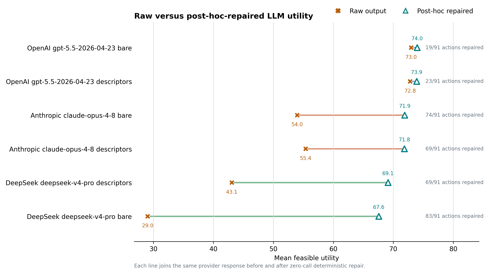
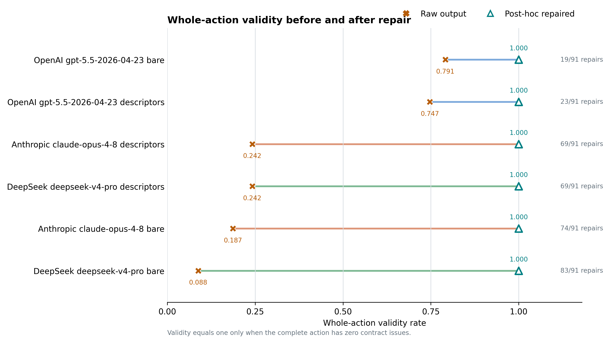
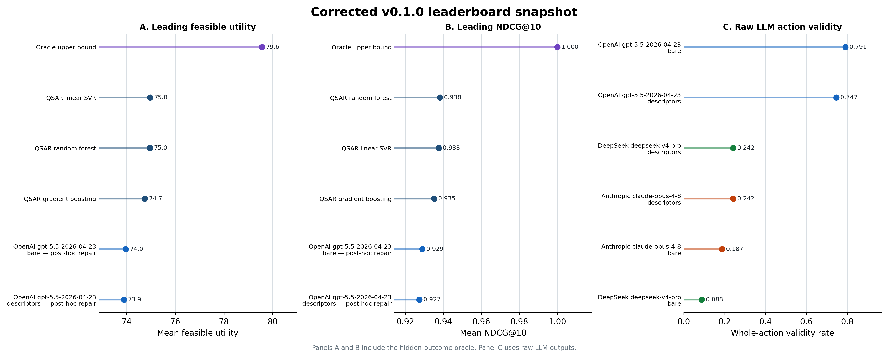
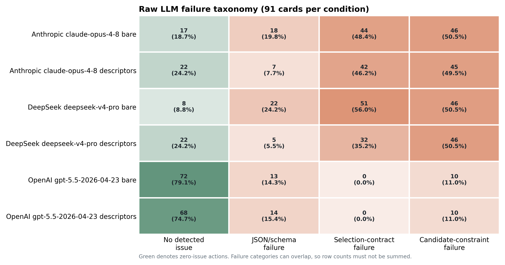
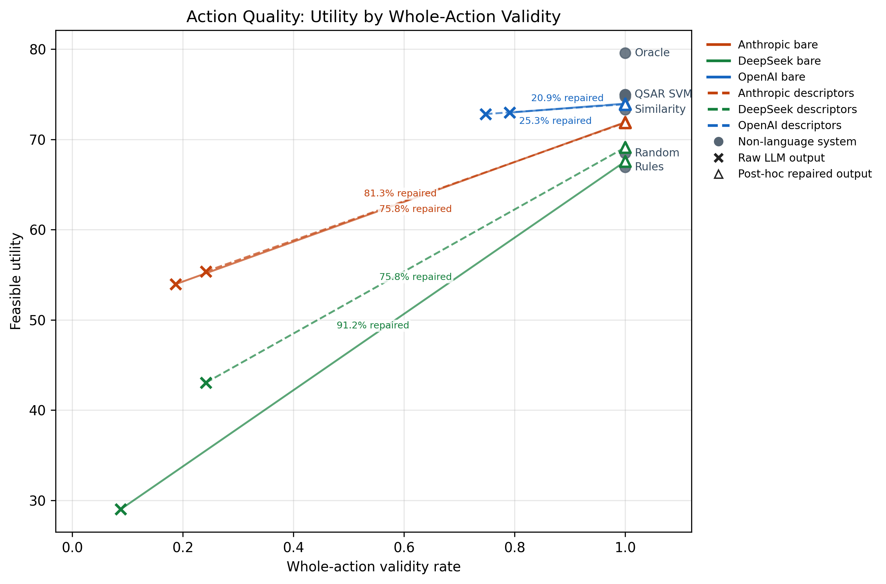
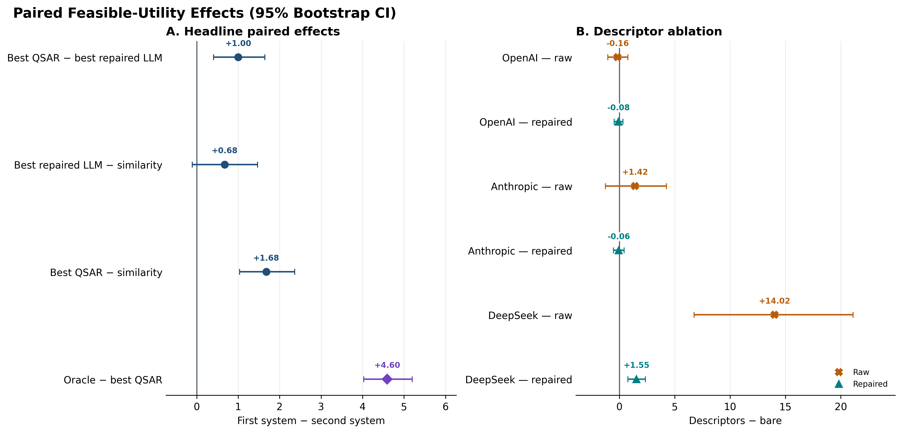

# SpecGuard-Chem v2 Results Summary

Generated at: `2026-07-27T15:22:07.210956+00:00`

Source comparison CSV: `release/v0.1.0/experiments/llm/comparison/system_comparison.csv`

This report is a computational audit artifact. It ranks provided candidate IDs only and does not claim synthesis feasibility, safety, selectivity, clinical utility, or therapeutic value.

## Benchmark Question

SpecGuard-Chem is an action-level unit test for constrained compound selection: can a system turn sparse project-local assay evidence into a useful, budget-constrained next-assay shortlist? Action utility is the primary scientific outcome. Contract validity is reported separately because a malformed action and a well-formed but scientifically weak action are different failures.

The comparison includes LLM selectors, deterministic baselines, conventional per-card QSAR models, and a hidden-outcome oracle control. The best primary system is **QSAR linear SVR** with feasible utility `74.966`. The oracle upper bound is `79.563`; the best final LLM row is **Bare LLM + post-hoc repair - OpenAI gpt-5.5-2026-04-23, low reasoning, direct JSON** at `73.964`, and the best raw LLM row is **Bare LLM - OpenAI gpt-5.5-2026-04-23, low reasoning, direct JSON** at raw feasible utility `72.966`.

## QSAR Baseline Interpretation

QSAR means quantitative structure-activity relationship modelling. Here, each QSAR row is trained separately for each decision card using only the support compounds' Morgan fingerprints and measured support activity. The trained model predicts candidate activity, then ranks feasible candidate IDs. It does not use hidden candidate activity and is therefore a deployable non-language comparator, unlike the oracle control.

QSAR is included as a serious non-language comparator, not as ground truth, a universal activity model, or a substitute for prospective medicinal-chemistry judgement. Its observed performance should be read directly from the table and paired card-level comparisons.

## Research Questions

- RQ1, how much action quality is attainable? Best primary feasible utility is `74.966` versus the oracle `79.563`.
- RQ2, how do LLM selectors compare with conventional prioritisation methods? Best final LLM utility is `73.964`; best QSAR is `74.966`; similarity-to-best-active is `73.288`.
- RQ3, does adding computed tool-summary fields change LLM action quality? Use matched bare-versus-tool-summary conditions and paired card-level deltas; do not infer a representation effect from unmatched rows.
- RQ4, are action validity and action utility distinct? Report zero-issue whole-action validity alongside utility; use compliance only for the valid-selection fraction and do not treat either validity measure as the primary scientific outcome.
- Audit question, how much does deterministic repair change the action? Raw metrics describe model behavior; final repaired metrics describe the guarded system.

## Paired Bootstrap Highlights

These deltas resample paired decision cards, so each comparison asks how two systems differed on the same cards rather than comparing independent aggregate means.

| comparison | metric | system_a_label | system_b_label | mean_delta | ci_95 | probability_delta_gt_zero |
| --- | --- | --- | --- | --- | --- | --- |
| oracle_minus_best_qsar | feasible_utility | Oracle upper-bound | QSAR linear SVR | 4.596 | 4.028 to 5.200 | 1.000 |
| oracle_minus_best_qsar | ndcg_at_k | Oracle upper-bound | QSAR linear SVR | 0.062 | 0.055 to 0.071 | 1.000 |
| oracle_minus_best_qsar | action_validity | Oracle upper-bound | QSAR linear SVR | 0.000 | 0.000 to 0.000 | 0.000 |
| best_qsar_minus_best_final_llm | feasible_utility | QSAR linear SVR | Bare LLM + post-hoc repair - OpenAI gpt-5.5-2026-04-23, low reasoning, direct JSON | 1.003 | 0.405 to 1.647 | 1.000 |
| best_qsar_minus_best_final_llm | ndcg_at_k | QSAR linear SVR | Bare LLM + post-hoc repair - OpenAI gpt-5.5-2026-04-23, low reasoning, direct JSON | 0.009 | 0.001 to 0.016 | 0.988 |
| best_qsar_minus_best_final_llm | action_validity | QSAR linear SVR | Bare LLM + post-hoc repair - OpenAI gpt-5.5-2026-04-23, low reasoning, direct JSON | 0.000 | 0.000 to 0.000 | 0.000 |
| best_qsar_minus_similarity | feasible_utility | QSAR linear SVR | Similarity-to-best-active baseline | 1.678 | 1.034 to 2.365 | 1.000 |
| best_qsar_minus_similarity | ndcg_at_k | QSAR linear SVR | Similarity-to-best-active baseline | 0.019 | 0.011 to 0.027 | 1.000 |
| best_qsar_minus_similarity | action_validity | QSAR linear SVR | Similarity-to-best-active baseline | 0.000 | 0.000 to 0.000 | 0.000 |
| best_final_llm_minus_similarity | feasible_utility | Bare LLM + post-hoc repair - OpenAI gpt-5.5-2026-04-23, low reasoning, direct JSON | Similarity-to-best-active baseline | 0.675 | -0.103 to 1.470 | 0.956 |
| best_final_llm_minus_similarity | ndcg_at_k | Bare LLM + post-hoc repair - OpenAI gpt-5.5-2026-04-23, low reasoning, direct JSON | Similarity-to-best-active baseline | 0.010 | 0.001 to 0.019 | 0.987 |
| best_final_llm_minus_similarity | action_validity | Bare LLM + post-hoc repair - OpenAI gpt-5.5-2026-04-23, low reasoning, direct JSON | Similarity-to-best-active baseline | 0.000 | 0.000 to 0.000 | 0.000 |
| best_final_llm_minus_rules | feasible_utility | Bare LLM + post-hoc repair - OpenAI gpt-5.5-2026-04-23, low reasoning, direct JSON | Rule/desirability baseline | 7.042 | 5.831 to 8.329 | 1.000 |
| best_final_llm_minus_rules | ndcg_at_k | Bare LLM + post-hoc repair - OpenAI gpt-5.5-2026-04-23, low reasoning, direct JSON | Rule/desirability baseline | 0.101 | 0.086 to 0.118 | 1.000 |
| best_final_llm_minus_rules | action_validity | Bare LLM + post-hoc repair - OpenAI gpt-5.5-2026-04-23, low reasoning, direct JSON | Rule/desirability baseline | 0.000 | 0.000 to 0.000 | 0.000 |

## Failure Taxonomy Summary

This table aggregates final-output validation failures across cards. Raw LLM repair behavior is still reported separately through raw metrics and repair rates.

| display_label | failure_type | cards_with_type | card_rate | total_issue_count | mean_issue_count_per_card |
| --- | --- | --- | --- | --- | --- |
| Bare LLM - DeepSeek deepseek-v4-pro, thinking off, direct JSON | selection_contract_failure | 51.000 | 0.560 | 356.000 | 3.912 |
| LLM plus tool summaries - DeepSeek deepseek-v4-pro, thinking off, direct JSON | constraint_failure | 46.000 | 0.505 | 199.000 | 2.187 |
| Bare LLM - DeepSeek deepseek-v4-pro, thinking off, direct JSON | constraint_failure | 46.000 | 0.505 | 192.000 | 2.110 |
| Bare LLM - Anthropic claude-opus-4-8, no extended thinking, direct JSON | constraint_failure | 46.000 | 0.505 | 182.000 | 2.000 |
| LLM plus tool summaries - Anthropic claude-opus-4-8, no extended thinking, direct JSON | constraint_failure | 45.000 | 0.495 | 163.000 | 1.791 |
| Bare LLM - Anthropic claude-opus-4-8, no extended thinking, direct JSON | selection_contract_failure | 44.000 | 0.484 | 90.000 | 0.989 |
| LLM plus tool summaries - Anthropic claude-opus-4-8, no extended thinking, direct JSON | selection_contract_failure | 42.000 | 0.462 | 76.000 | 0.835 |
| LLM plus tool summaries - DeepSeek deepseek-v4-pro, thinking off, direct JSON | selection_contract_failure | 32.000 | 0.352 | 184.000 | 2.022 |
| Bare LLM - DeepSeek deepseek-v4-pro, thinking off, direct JSON | schema_failure | 22.000 | 0.242 | 45.000 | 0.495 |
| Bare LLM - Anthropic claude-opus-4-8, no extended thinking, direct JSON | schema_failure | 18.000 | 0.198 | 36.000 | 0.396 |
| LLM plus tool summaries - OpenAI gpt-5.5-2026-04-23, low reasoning, direct JSON | schema_failure | 14.000 | 0.154 | 28.000 | 0.308 |
| Bare LLM - OpenAI gpt-5.5-2026-04-23, low reasoning, direct JSON | schema_failure | 13.000 | 0.143 | 26.000 | 0.286 |
| LLM plus tool summaries - OpenAI gpt-5.5-2026-04-23, low reasoning, direct JSON | constraint_failure | 10.000 | 0.110 | 15.000 | 0.165 |
| Bare LLM - OpenAI gpt-5.5-2026-04-23, low reasoning, direct JSON | constraint_failure | 10.000 | 0.110 | 14.000 | 0.154 |

## Report Figures

### Corrected Figure 1–8 series

This complete replacement for the retired paper-50 figure package uses the corrected 91-card benchmark, all 546 recorded raw LLM requests, and six zero-call post-hoc-repaired views.

**Figure 1. Decision-card anatomy and leakage boundary.**

**Figure 2. Corrected benchmark pipeline.**

**Figure 3. Main feasible-utility comparison.**

**Figure 4. System NDCG@10 comparison.**

**Figure 5. Raw versus post-hoc-repaired LLM utility.**

**Figure 6. Raw versus post-hoc-repaired whole-action validity.**

**Figure 7. Corrected leaderboard summary.**

**Figure 8. Raw LLM failure taxonomy.**

### Additional inferential views

These views are generated from the same comparison and paired card-level tables. Repaired rows are deterministic views of recorded raw responses, not additional provider calls.

Additional diagnostic figures: [complete primary leaderboard](figures/v0.1.0/primary_utility_leaderboard.png), [repair decomposition](figures/v0.1.0/llm_repair_effect.png), [standalone descriptor ablation](figures/v0.1.0/descriptor_ablation.png), [across-card utility distributions](figures/v0.1.0/card_level_utility_distribution.png), [across-card utility-difference distributions](figures/v0.1.0/card_level_delta_distribution.png), [per-card QSAR-versus-LLM scatter](figures/v0.1.0/card_level_qsar_vs_llm_scatter.png).

## Card-Level Diagnostics

Per-card diagnostic tables are written next to the comparison CSV in `release/v0.1.0/experiments/llm/comparison`. `make-figures` also writes the report-level leaderboard, repair analysis, paired-effect forest plots, card-level utility distributions, utility-delta distributions, and a QSAR-versus-LLM per-card scatter plot.

## Primary Systems

| display_label | system_name | feasible_utility | feasible_utility_ci_low | feasible_utility_ci_high | raw_feasible_utility | ndcg_at_k | ndcg_at_k_ci_low | ndcg_at_k_ci_high | raw_ndcg_at_k | constrained_regret | action_validity | action_validity_ci_low | action_validity_ci_high | raw_action_validity | compliance_rate | raw_compliance_rate | schema_error_rate | raw_schema_error_rate | repaired_from_empty_rate |
| --- | --- | --- | --- | --- | --- | --- | --- | --- | --- | --- | --- | --- | --- | --- | --- | --- | --- | --- | --- |
| QSAR linear SVR | qsar_svm | 74.966 | 72.830 | 77.032 | 74.966 | 0.938 | 0.929 | 0.945 | 0.938 | 4.596 | 1.000 | 1.000 | 1.000 | 1.000 | 1.000 | 1.000 | 0.000 | 0.000 | 0.000 |
| QSAR random forest | qsar_rf | 74.958 | 72.825 | 77.142 | 74.958 | 0.938 | 0.930 | 0.946 | 0.938 | 4.605 | 1.000 | 1.000 | 1.000 | 1.000 | 1.000 | 1.000 | 0.000 | 0.000 | 0.000 |
| QSAR gradient boosting | qsar_gbt | 74.750 | 72.621 | 76.859 | 74.750 | 0.935 | 0.927 | 0.943 | 0.935 | 4.813 | 1.000 | 1.000 | 1.000 | 1.000 | 1.000 | 1.000 | 0.000 | 0.000 | 0.000 |
| Bare LLM + post-hoc repair - OpenAI gpt-5.5-2026-04-23, low reasoning, direct JSON | bare_llm__openai_gpt_5_5_2026_04_23_selector__posthoc_repair | 73.964 | 71.861 | 75.932 | 72.966 | 0.929 | 0.920 | 0.936 | 0.916 | 5.599 | 1.000 | 1.000 | 1.000 | 0.791 | 1.000 | 0.985 | 0.000 | 0.143 | 0.000 |
| LLM plus tool summaries + post-hoc repair - OpenAI gpt-5.5-2026-04-23, low reasoning, direct JSON | llm_tools__openai_gpt_5_5_2026_04_23_selector__posthoc_repair | 73.889 | 71.814 | 75.984 | 72.805 | 0.927 | 0.918 | 0.935 | 0.916 | 5.674 | 1.000 | 1.000 | 1.000 | 0.747 | 1.000 | 0.984 | 0.000 | 0.154 | 0.000 |
| Similarity-to-best-active baseline | similarity_to_best_active | 73.288 | 71.264 | 75.236 | 73.288 | 0.919 | 0.909 | 0.927 | 0.919 | 6.274 | 1.000 | 1.000 | 1.000 | 1.000 | 1.000 | 1.000 | 0.000 | 0.000 | 0.000 |
| Bare LLM - OpenAI gpt-5.5-2026-04-23, low reasoning, direct JSON | bare_llm__openai_gpt_5_5_2026_04_23_selector | 72.966 | 70.740 | 75.177 | 72.966 | 0.916 | 0.902 | 0.927 | 0.916 | 6.596 | 0.791 | 0.703 | 0.868 | 0.791 | 0.985 | 0.985 | 0.143 | 0.143 | 0.000 |
| LLM plus tool summaries - OpenAI gpt-5.5-2026-04-23, low reasoning, direct JSON | llm_tools__openai_gpt_5_5_2026_04_23_selector | 72.805 | 70.668 | 74.974 | 72.805 | 0.916 | 0.905 | 0.927 | 0.916 | 6.758 | 0.747 | 0.659 | 0.835 | 0.747 | 0.984 | 0.984 | 0.154 | 0.154 | 0.000 |
| Bare LLM + post-hoc repair - Anthropic claude-opus-4-8, no extended thinking, direct JSON | bare_llm__anthropic_opus_4_8_selector__posthoc_repair | 71.904 | 69.850 | 74.035 | 53.956 | 0.908 | 0.898 | 0.918 | 0.657 | 7.658 | 1.000 | 1.000 | 1.000 | 0.187 | 1.000 | 0.723 | 0.000 | 0.198 | 0.000 |
| LLM plus tool summaries + post-hoc repair - Anthropic claude-opus-4-8, no extended thinking, direct JSON | llm_tools__anthropic_opus_4_8_selector__posthoc_repair | 71.847 | 69.894 | 73.913 | 55.372 | 0.907 | 0.898 | 0.917 | 0.689 | 7.716 | 1.000 | 1.000 | 1.000 | 0.242 | 1.000 | 0.748 | 0.000 | 0.077 | 0.000 |
| LLM plus tool summaries + post-hoc repair - DeepSeek deepseek-v4-pro, thinking off, direct JSON | llm_tools__deepseek_v4_pro_2026_07_16_selector__posthoc_repair | 69.111 | 67.138 | 71.200 | 43.050 | 0.865 | 0.853 | 0.878 | 0.530 | 10.452 | 1.000 | 1.000 | 1.000 | 0.242 | 1.000 | 0.610 | 0.000 | 0.055 | 0.000 |
| Random valid baseline | random_valid | 68.469 | 66.487 | 70.450 | 68.469 | 0.855 | 0.842 | 0.867 | 0.855 | 11.094 | 1.000 | 1.000 | 1.000 | 1.000 | 1.000 | 1.000 | 0.000 | 0.000 | 0.000 |
| Bare LLM + post-hoc repair - DeepSeek deepseek-v4-pro, thinking off, direct JSON | bare_llm__deepseek_v4_pro_2026_07_16_selector__posthoc_repair | 67.564 | 65.564 | 69.625 | 29.030 | 0.843 | 0.828 | 0.859 | 0.346 | 11.998 | 1.000 | 1.000 | 1.000 | 0.088 | 1.000 | 0.413 | 0.000 | 0.242 | 0.000 |
| Rule/desirability baseline | rules_only | 66.922 | 64.772 | 69.062 | 66.922 | 0.828 | 0.812 | 0.844 | 0.828 | 12.641 | 1.000 | 1.000 | 1.000 | 1.000 | 1.000 | 1.000 | 0.000 | 0.000 | 0.000 |
| LLM plus tool summaries - Anthropic claude-opus-4-8, no extended thinking, direct JSON | llm_tools__anthropic_opus_4_8_selector | 55.372 | 51.166 | 59.489 | 55.372 | 0.689 | 0.638 | 0.740 | 0.689 | 24.190 | 0.242 | 0.154 | 0.330 | 0.242 | 0.748 | 0.748 | 0.077 | 0.077 | 0.000 |
| Bare LLM - Anthropic claude-opus-4-8, no extended thinking, direct JSON | bare_llm__anthropic_opus_4_8_selector | 53.956 | 49.428 | 58.403 | 53.956 | 0.657 | 0.601 | 0.711 | 0.657 | 25.607 | 0.187 | 0.110 | 0.275 | 0.187 | 0.723 | 0.723 | 0.198 | 0.198 | 0.000 |
| LLM plus tool summaries - DeepSeek deepseek-v4-pro, thinking off, direct JSON | llm_tools__deepseek_v4_pro_2026_07_16_selector | 43.050 | 37.575 | 48.690 | 43.050 | 0.530 | 0.465 | 0.596 | 0.530 | 36.512 | 0.242 | 0.165 | 0.341 | 0.242 | 0.610 | 0.610 | 0.055 | 0.055 | 0.000 |
| Bare LLM - DeepSeek deepseek-v4-pro, thinking off, direct JSON | bare_llm__deepseek_v4_pro_2026_07_16_selector | 29.030 | 23.751 | 34.701 | 29.030 | 0.346 | 0.281 | 0.414 | 0.346 | 50.532 | 0.088 | 0.033 | 0.154 | 0.088 | 0.413 | 0.413 | 0.242 | 0.242 | 0.000 |

## Oracle Controls

| display_label | system_name | feasible_utility | feasible_utility_ci_low | feasible_utility_ci_high | raw_feasible_utility | ndcg_at_k | ndcg_at_k_ci_low | ndcg_at_k_ci_high | raw_ndcg_at_k | constrained_regret | action_validity | action_validity_ci_low | action_validity_ci_high | raw_action_validity | compliance_rate | raw_compliance_rate | schema_error_rate | raw_schema_error_rate | repaired_from_empty_rate |
| --- | --- | --- | --- | --- | --- | --- | --- | --- | --- | --- | --- | --- | --- | --- | --- | --- | --- | --- | --- |
| Oracle upper-bound | oracle_valid_topk | 79.563 | 77.486 | 81.812 | 79.563 | 1.000 | 1.000 | 1.000 | 1.000 | 0.000 | 1.000 | 1.000 | 1.000 | 1.000 | 1.000 | 1.000 | 0.000 | 0.000 | 0.000 |

## Reading Guide

- Higher feasible utility and NDCG@k are better.
- Raw columns score the model output before deterministic validator repair.
- Final columns score the selected output after validator repair where applicable.
- `action_validity` is the zero-issue whole-action rate; `compliance_rate` is only the valid-selection fraction and can remain 1.0 when another contract error invalidates the action.
- Lower constrained regret and schema error rate are better.
- Oracle controls are sanity checks and must not be mixed into primary system claims.

## Label and Metric Glossary

### Study terms

- CARA: public compound-activity benchmark used here as the source substrate for assay-level support/query tasks.
- LO: lead optimisation. In this project, LO cards represent an observed support set plus candidate compounds to prioritise next.
- VS: virtual screening. VS is not the primary run here; it usually means ranking a broader candidate set for activity.
- Decision card: one benchmark instance containing support compounds, a candidate pool, hard constraints, budget `k`, and hidden activity values used only by the scorer.
- Support set: already-tested compounds with measured activity that systems may learn from but must not recommend.
- Candidate pool: compounds eligible for selection, subject to hard constraints.
- QSAR: quantitative structure-activity relationship; here, conventional ML regressors trained separately for each decision card on support-set Morgan fingerprints and measured support activity, then used to rank feasible candidates by predicted activity. QSAR rows are deployable baselines, not oracle controls.
- Oracle: non-deployable upper-bound scorer that uses hidden activity values. It is a sanity check, not a real model.
- Validator: deterministic harness logic that checks schema, candidate IDs, duplicates, support-set exclusion, and molecular constraints. It does not use hidden activity values.
- Direct JSON: the current LLM prompt profile that asks for final JSON only, reducing failures where reasoning/prose consumes the visible output budget.

### System labels

- `oracle_valid_topk`: non-deployable upper-bound control that uses hidden candidate activity values to choose the best valid top-k set.
- `random_valid`: random valid-candidate baseline.
- `rules_only`: deterministic fallback/rule ranking after applying hard constraints.
- `similarity_to_best_active`: ranks candidates by molecular similarity to the best active support compound.
- `qsar_rf`: random forest QSAR regressor trained per card on support-set Morgan fingerprints and measured activity.
- `qsar_gbt`: gradient-boosting QSAR regressor trained per card on support-set Morgan fingerprints and measured activity.
- `qsar_svm`: sparse-scaled linear-kernel support-vector QSAR regressor trained per card on support-set Morgan fingerprints and measured activity.
- `bare_llm`: LLM receives the decision card and returns candidate IDs without deterministic repair.
- `llm_tools`: LLM condition with extra computed descriptor/tool-summary fields in the candidate rows.
- `llm_validator`: guarded LLM system; raw output is checked and invalid/missing slots may be deterministically repaired.
- `llm_tools_validator`: tool-summary LLM condition plus deterministic checking and repair.
- `*_frontier_selector`: legacy internal run ID for the direct-JSON condition. Reader-facing labels should use the provider, exact model name, and reasoning/thinking setting instead of this shorthand.
- `*_frontier`: legacy internal run ID for the original full-pool frontier-model condition. Some rows are diagnostic interface failures, not clean model-capability measurements.
- `*_fast`: legacy internal run ID for lower-latency/lower-cost provider conditions.

### Metrics

- `feasible_utility`: sum of hidden activity values for selected candidates that satisfy all hard constraints. Higher is better.
- `raw_feasible_utility`: feasible utility before deterministic validator repair. This is the closer measure of raw LLM behavior.
- `ndcg_at_k`: ranking-quality score using hidden activity as graded relevance. Higher is better; `1.0` is ideal ranking.
- `raw_ndcg_at_k`: NDCG before deterministic validator repair.
- `constrained_regret`: oracle valid top-k utility minus observed feasible utility. Lower is better.
- `action_validity`: whole-action validity after final repair, if repair applies; `1` only when the complete output has zero validation issues, otherwise `0`. The run summary is the fraction of fully valid actions.
- `raw_action_validity`: the same zero-issue whole-action check before deterministic validator repair.
- `compliance_rate`: valid-selection fraction after final repair: valid selected entries divided by requested `k`. It is not whole-action validity.
- `raw_compliance_rate`: valid-selection fraction before deterministic validator repair.
- `schema_error_rate`: fraction of cards with final schema/contract errors.
- `raw_schema_error_rate`: schema/contract error rate before deterministic validator repair.
- `repaired_from_empty_rate`: fraction of cards where the validator repaired an empty raw selection list. This should be near zero for a usable LLM interface.

### Interpretation rules

- Raw metrics describe model behavior; final metrics for `*_validator` rows describe model plus deterministic guardrail behavior.
- Oracle controls are sanity checks, not systems that could be used prospectively.
- Action utility is the primary scientific outcome. A row can have a high valid-selection fraction yet still be invalid as a whole or scientifically weak, so these diagnostics remain separate.
